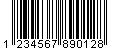
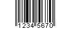
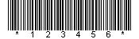
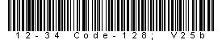
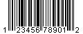
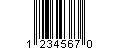
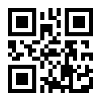
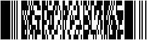

# brcode
条形码的组件网上有很多，除了``zxing``之外，别的都是N年不维护了。而``zxing``只生成纯条码。

## 项目介绍
基于``zxing``，实现条形码带数字输出。参照标准输出格式，在``zxing``生成的纯条码图片的基础上做了调整，加入文本内容。

编码格式 | 说明 | 效果展示
---- | ---- | ----
EAN-13 | 十二位数字 + 一位校验码 | 
EAN-8 | 七位数字 + 一位校验码 | 
CODE-39 | 字符和数字，不定长 | 
CODE-128 | ASCII0-127，不定长 |
UPC-A | 十一位数字 + 一位校验码 | 
UPC-E | 七位数字 + 一位校验码 | 
QR Code | 二维码 | 
PDF-417 | PDF417二维条码 | 

## 使用说明
主要是对上面六种一维条码的格式进行了调整，其他的条码格式直接在底部居中显示文本。

- 解码使用同一个方法：``BrQrCodeUtil.decode``
- 编码
    - 一维条码(``BrQrCodeUtil.brEncode``)
    - 二维QR码(``BrQrCodeUtil.qrEncode``)
    - 二维条码(``BrQrCodeUtil.pdf417Encode``)

以EAN-13为例
```java
BrQrCodeUtil.brEncode(条码内容, BarcodeFormat.EAN_13, 文件对象);

// 如果条码内容是12位数字，则自动计算出第十三位。    
// 如果是13位数字，会进行校验，失败抛出异常。
```
主要支持
``com.google.zxing.BarcodeFormat``
- BarcodeFormat.EAN_8
- BarcodeFormat.EAN_13
- BarcodeFormat.UPC_A
- BarcodeFormat.UPC_E
- BarcodeFormat.CODE_39
- BarcodeFormat.CODE_128

## 2021年5月10日
增加``PDF-417``二维条形码。见国标``《GB/T 17172-1997 四一七条码》``。
常用于政府公文。
```java
BrQrCodeUtil.pdf417Encode(str, file, 300, 150);
```

## 下一步计划
调整相关API，自动配置尺寸和位置。
